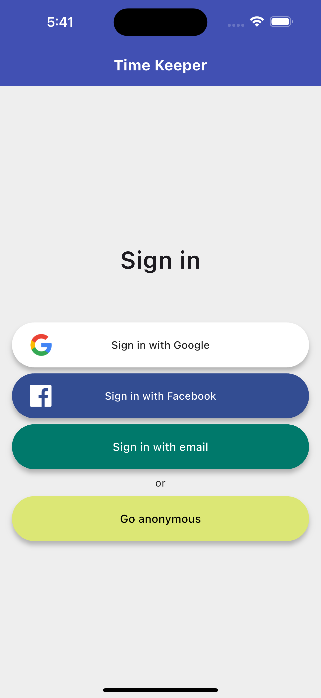
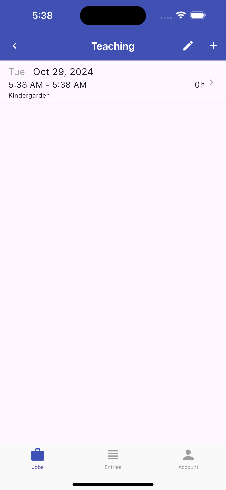
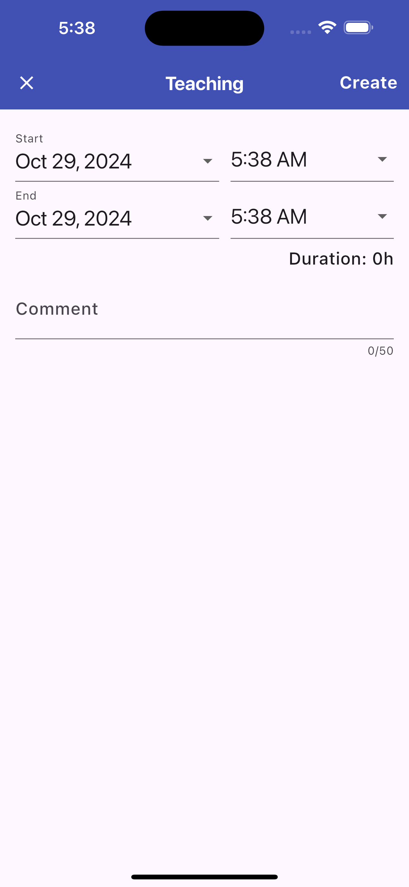
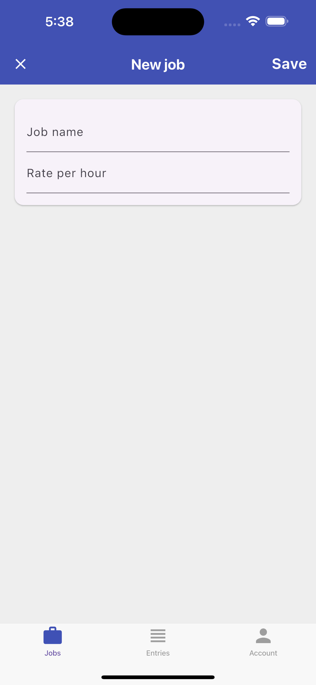
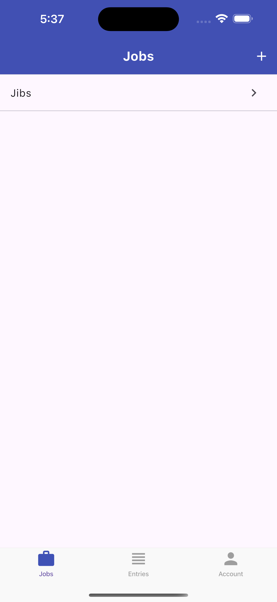
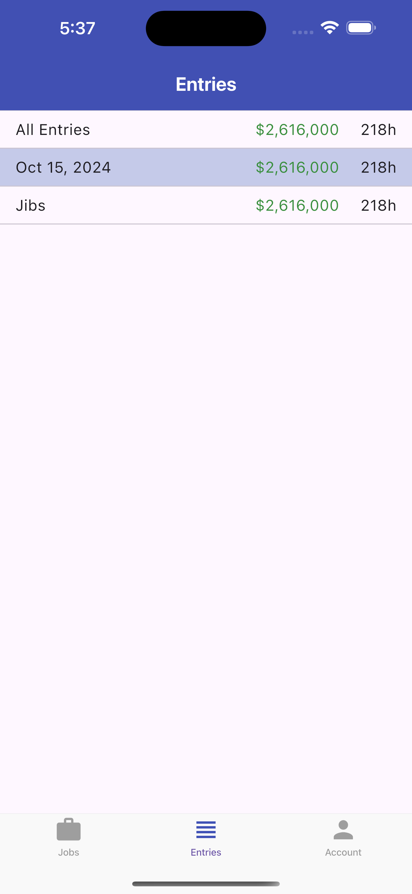
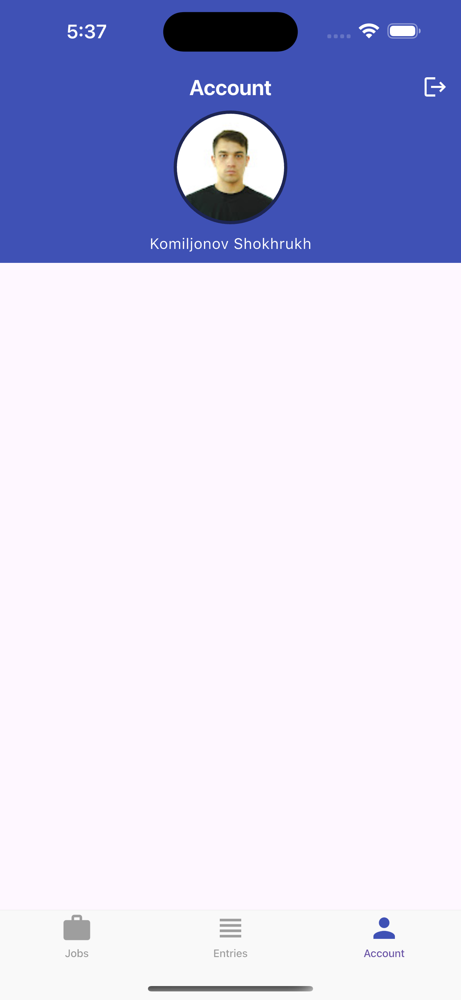
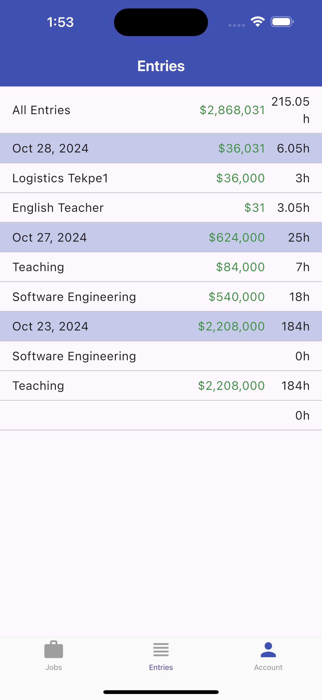

# Timekeeper

A Time Keeper App helps users log and monitor the time they spend on various tasks or projects. It’s especially useful for freelancers, employees, students, or anyone who wants to manage their productivity and time effectively.

Key Features of a Time Keeper App:
Task/Project Management: Users can create tasks or projects to track.
Timer Functionality: Start, pause, and stop timers for each task.
Manual Time Entry: Option to add or adjust time manually.
Reports and Analytics: View time spent through charts or summaries.
Notifications: Alerts to remind users of tasks or breaks.
Multi-Device Sync (optional): Data is accessible across devices.
Use Cases:
Freelancers: Track billable hours for clients.
Employees: Monitor productivity and submit time reports.
Students: Track study sessions and break times.
Teams: Collaborate on projects by logging individual hours.
In summary, a Time Keeeer App helps users stay organized and ensures accountability by giving insights into how their time is being spent.

 

